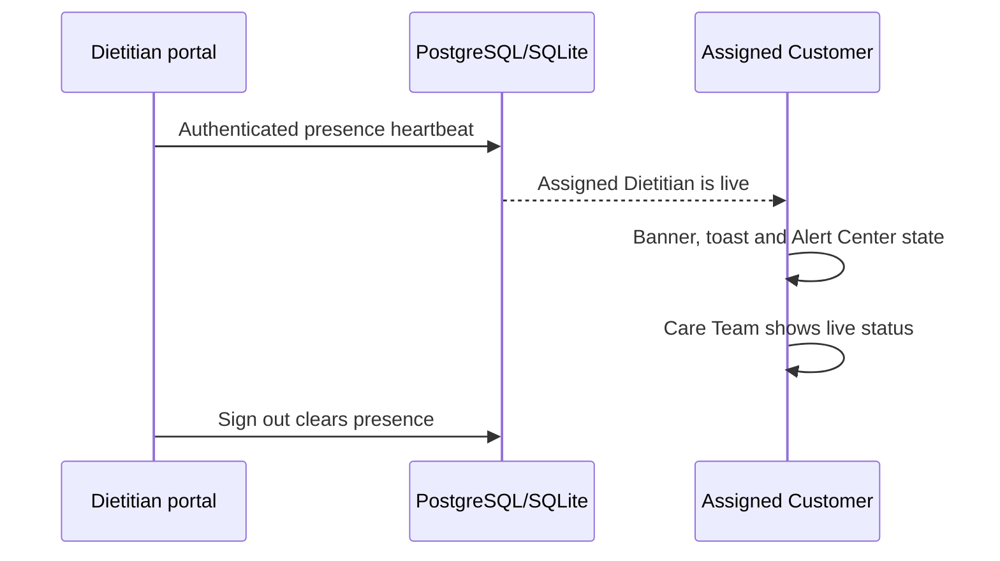
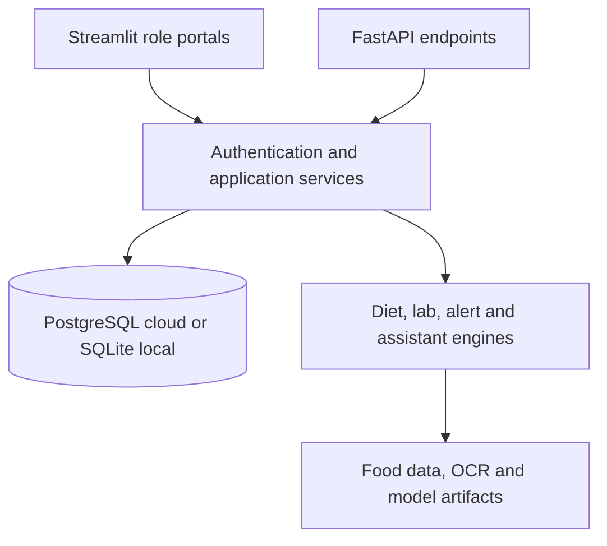

# NutriPulse AI — Complete Project and Implementation Document

**Application version:** 4.10.2

**Document date:** 1 September 2026

**Repository:** [abdmughal0912-sudo/Nutripulse](https://github.com/abdmughal0912-sudo/Nutripulse)

**Live application:** [nutripulse-ai.streamlit.app](https://nutripulse-ai.streamlit.app/)

## 1. Executive summary

NutriPulse AI is a role-separated nutrition intelligence platform for Customers, Dietitians and Administrators. It combines account management, food and laboratory analysis, individualized diet planning, scheduled meal tracking, clinical collaboration, alerts, analytics and a grounded nutrition assistant in one Streamlit application. A FastAPI service exposes selected features for integrations.

The hosted application uses PostgreSQL so accounts and clinical records survive Streamlit reboots and GitHub redeployments. Local Windows installations use SQLite automatically. Runtime credentials, private databases and person-level source records are intentionally excluded from GitHub.

NutriPulse is nutrition decision support. It is not a diagnostic system, emergency service or replacement for licensed clinical judgment.

## 2. Implemented requirements

### 2.1 Public landing page and authentication

- Luxury dark public landing page with responsive nutrition imagery and capability cards.
- **Log in** and **Sign up** actions remain at the top-right on supported desktop widths and fit safely on small screens.
- Compact, centered authentication board for login, registration and password recovery.
- Customer, Dietitian and Administrator registration paths.
- One-time six-digit email code during sign-up.
- Username-and-password login after the account email has been verified; OTP is not requested on every login.
- Separate six-digit email code for **Forgot Password** before a PBKDF2 password hash can be replaced.
- Ten-minute code expiry, five-attempt limit and 60-second resend cooldown.
- Mobile, tablet, laptop and desktop layouts with stacked forms, scroll-safe tabs/tables, responsive charts and reduced-motion support.
- Light cyan, lilac, champagne and mint portal accents, animated star-wave layers and normal readable text sizing.

### 2.2 Permanent accounts and storage

- PostgreSQL is selected automatically when `NUTRIPULSE_DATABASE_URL` is configured.
- SQLite remains the local Windows and isolated-test backend.
- Customer, Dietitian and Administrator accounts, profiles, plans, reports, messages, alerts and meal progress persist in PostgreSQL across app reboots and code deployments.
- Administrator Governance shows the active database engine and whether cloud storage is reboot-safe.
- A conflict-safe SQLite-to-PostgreSQL migration utility is included at `scripts/migrate_sqlite_to_postgres.py`.
- Database schema changes are additive and preserve existing approved accounts and records.

### 2.3 Customer workspace

- Daily overview with current schedule, reminders, active alerts and progress.
- Profile management for goals, measurements, activity, cuisine, conditions, allergies and medicines.
- Smart Diet Planner with calorie, macro, fibre and seven-day meal targets.
- Monday-to-Sunday schedule with **Clear meal**, **Skip**, **Restore** and **Undo** actions.
- Automatic next-day progression and Week 1 → Week 2 advancement.
- Daily, weekly, adherence, weight, hydration and completion analytics.
- Food Diary, Food Vision and Nutrition Classifier workflows.
- Laboratory Intelligence with image/PDF extraction, manual verification and safety analysis.
- Alert Center with persistent safety and schedule notifications.
- Care Team workspace for assigned Dietitian details, questionnaires, recommendations, prescriptions and secure messages.
- NutriGuide Assistant with optional voice replies and message sounds.

### 2.4 Dietitian workspace

- Dietitian registration remains inactive until Administrator approval.
- Caseload is limited to active Administrator assignments.
- Customer overview with profile, BMI, conditions, allergies, flags and progress.
- Diary and longitudinal schedule review.
- Laboratory report review and safety-gated planning.
- Smart plan builder with formal review status.
- Private clinical notes that never appear in the Customer portal.
- Customer-visible nutrition prescriptions, questions, recommendations and secure messages.
- Authenticated presence heartbeat while the approved Dietitian portal is active.

### 2.5 Administrator workspace

- Protected first-Administrator setup using `NUTRIPULSE_ADMIN_SETUP_CODE`.
- Dietitian application approval and rejection.
- Active caseload assignment and reassignment.
- Customer and Dietitian account visibility.
- Role-aware customer overview and longitudinal analytics.
- Database/storage status, cloud reboot-safety warning and API/model status.
- Customer clinical data is not deleted during GitHub releases or additive schema migrations.

## 3. Dietitian live status and customer notification

NutriPulse 4.10 implements presence only for approved Dietitians and only for Customers linked by an active Administrator caseload assignment.



Operational behavior:

- The Dietitian portal refreshes the authenticated heartbeat every 60 seconds.
- Assigned Customers are checked every 60 seconds and receive a **DIETITIAN IS LIVE** toast when the state changes.
- The Customer portal shows a live banner and a persistent Care Team alert while the Dietitian is active.
- Care Team shows **DIETITIAN IS LIVE** or **DIETITIAN IS OFFLINE** in a top-right status card.
- Explicit sign-out clears presence immediately.
- If the browser is closed without sign-out, the status expires after five minutes by default.
- Presence is availability information, not a guarantee of immediate or emergency response.

The expiry can be configured with `NUTRIPULSE_PRESENCE_TTL_SECONDS`; accepted values are bounded from 60 to 1,800 seconds.

## 4. NutriGuide Assistant and audio

The built-in NutriGuide is a grounded nutrition-support engine. It uses the active Customer profile, verified laboratory results, current diet plan and saved meal-schedule progress. It can:

- Explain the active diet plan and its calorie, protein and fibre targets.
- Summarize verified laboratory flags without diagnosing disease.
- Build plan-linked grocery lists.
- Suggest allergy-aware meal substitutions.
- Produce simple recipes and preparation guidance from planned meals.
- Summarize daily and weekly schedule progress.
- Escalate emergency, medication, kidney and other high-risk questions to appropriate professional review.

Each response includes intent, confidence, grounding sources and whether clinical review is required. An optional external assistant API can be enabled only after explicit Customer consent; the built-in assistant remains available when no external service is configured.

Audio behavior:

- **Voice replies** use the device browser's native text-to-speech engine.
- **Message sounds** use a small locally generated WAV chime; no third-party audio file is loaded.
- **Voice alerts** can speak new Dietitian-live, meal and critical-alert messages.
- All audio controls are off by default and must be enabled by the Customer.
- Browser autoplay rules may require one interaction before audio can play.
- NutriPulse does not upload microphone recordings for text-to-speech.

## 5. Laboratory Intelligence and individualized planning

### 5.1 Report processing

NutriPulse accepts laboratory images and PDF reports. Bundled RapidOCR, scanned-PDF rendering and PDF table extraction identify recognized tests. Values enter an editable verification screen and are not used for planning until the user confirms them.

The latest verified report is restored from the database after restart or Customer switching. This prevents the planner from silently falling back to a generic wellness template.

### 5.2 Report-specific planning

The planning engine uses the verified values, Customer profile, goal, activity, conditions, allergies and active professional restrictions. Distinct findings can change:

- Plan title and clinical focus.
- Daily calories, protein, carbohydrate, fat and fibre targets.
- Meal selection and substitutions.
- Food preparation instructions.
- Foods to prioritize or restrict.
- Required professional review.

Configured strategy groups include glucose, cholesterol, triglycerides, vitamin D, B12/folate, blood-count signals, CRP/inflammation, liver findings, uric acid and hypertension. Kidney, electrolyte and thyroid findings remain clinician-led. Critical results block autonomous plan generation.

The **Why this plan is different** panel and downloaded PDF identify the verified report values used and explain how each value changed—or safely did not change—the plan. Previously saved plans are preserved; a new plan must be generated to use a newer verified report.

## 6. Food Vision, diary and classifier

- Food Vision accepts a local image or safe public image URL.
- The bundled Food-101 ONNX model recognizes 101 image classes.
- OpenCV DNN is the Windows fallback when optional ONNX Runtime DLL loading is blocked.
- Low-confidence or low-margin predictions require the user to confirm the actual dish before nutrition is attached.
- Confirmed regional foods, including biryani aliases, are reranked against the complete nutrition database.
- Nutrition values come from the closest database food and selected portion, not directly from pixels.
- Food images cannot verify exact ingredients, allergens, cross-contact, recipe quantities or portion size.
- The portable food-quality classifier runs without SciPy or scikit-learn in production.

## 7. Data and model lineage

The repository contains aggregate lineage for all 76,920 supplied source rows:

- 70,920 food/product-related source rows.
- 47,152 classifier-ready unique food profiles.
- 8,329 dedicated safety-source rows.
- 6,000 population benchmark rows summarized in aggregate form.

The person-level source registry is excluded from the public repository. It may be generated locally only from authorized source datasets using:

```bash
python scripts/build_unified_data.py --source-dir PATH_TO_NINE_CSVS --project-dir .
```

The deployed portable classifier and Food Vision model cards are stored in `models/`. Model confidence is not clinical certainty.

## 8. Architecture



Important implementation locations:

- `app.py` — public page, authentication and all role workspaces.
- `api.py` — REST API and request/response contracts.
- `src/database.py` — PostgreSQL/SQLite compatibility and persistence.
- `src/auth.py` and `src/email_otp.py` — credentials, sign-up verification and recovery.
- `src/diet_engine.py` and `src/lab_analyzer.py` — nutrition plans and laboratory rules.
- `src/food_analysis.py`, `src/ml_engine.py` and `src/portable_classifier.py` — Food Vision and classification.
- `src/alerts.py` — safety, meal and live-Dietitian alerts.
- `src/assistant.py` and `src/chat_audio.py` — grounded NutriGuide and opt-in browser audio.
- `src/landing_theme.py` and `src/portal_theme.py` — responsive public/authenticated UI.

## 9. Security and privacy controls

- PBKDF2-SHA256 password hashing with per-password salt.
- One-time email verification before a new account becomes active.
- Password recovery only after a separate expiring email challenge.
- Private first-Administrator setup secret.
- Dietitian approval and active caseload enforcement.
- Customer-hidden clinical notes.
- Consent gate before any minimized context is sent to an external assistant service.
- Server-side URL validation, private-network blocking, redirect checks, content-type checks and response-size limits for public web/image extraction.
- Production API key and strict CORS configuration support.
- Runtime databases, `.env`, Streamlit Secrets, Administrator code and customer exports are excluded from GitHub.

Production use still requires HTTPS, encrypted backups, access logging, retention/deletion procedures, incident response, jurisdiction-specific privacy review and validation by qualified local clinicians.

## 10. Required production configuration

Store these values in the hosting provider's private secret manager. Never commit real values.

```text
NUTRIPULSE_ADMIN_SETUP_CODE=<long private setup code>
NUTRIPULSE_DATABASE_URL=<managed PostgreSQL URL with TLS>
NUTRIPULSE_API_KEY=<long API secret>
NUTRIPULSE_CORS_ORIGINS=https://your-frontend.example
NUTRIPULSE_UTC_OFFSET_HOURS=5
NUTRIPULSE_SMTP_HOST=smtp.gmail.com
NUTRIPULSE_SMTP_PORT=587
NUTRIPULSE_SMTP_USERNAME=your-sender@gmail.com
NUTRIPULSE_SMTP_PASSWORD=<Google App Password>
NUTRIPULSE_SMTP_SENDER_EMAIL=your-sender@gmail.com
NUTRIPULSE_SMTP_SENDER_NAME=NutriPulse AI
NUTRIPULSE_PRESENCE_TTL_SECONDS=300
```

Optional external assistant configuration:

```text
NUTRIPULSE_ASSISTANT_API_URL=https://approved-service.example/ask
NUTRIPULSE_ASSISTANT_API_KEY=<secret>
```

## 11. Deployment

### 11.1 Local Windows

1. Install Python 3.12 or 3.11.
2. Download and extract the repository.
3. Open the project folder.
4. Run `START_ALL.bat`.
5. Use the locally generated SQLite database unless a PostgreSQL URL is deliberately configured.

The normal runtime does not require SciPy or scikit-learn.

### 11.2 Streamlit Community Cloud

1. Deploy `app.py` from the GitHub `main` branch.
2. Add all private secrets under Streamlit **App settings → Secrets**.
3. Configure `NUTRIPULSE_DATABASE_URL`; Streamlit's local SQLite file is temporary and must not be used for permanent cloud accounts.
4. Save secrets and reboot the app.
5. Create the first Administrator with the private setup code.
6. Open Administrator Governance and confirm **Database: PostgreSQL** and **Cloud reboot safe: Yes**.
7. Create a test Customer, reboot once and confirm the account remains.

Detailed hosting and migration guidance is in `DEPLOYMENT.md`.

## 12. Main API endpoints

- `GET /health`
- `GET /api/v1/foods/search`
- `POST /api/v1/classifier/predict`
- `POST /api/v1/labs/analyze`
- `POST /api/v1/diet/plan`
- `POST /api/v1/vision/predict`
- `POST /api/v1/vision/analyze`
- `POST /api/v1/vision/analyze-url`
- `POST /api/v1/diary/vision-url`
- `GET /api/v1/diary`
- `POST /api/v1/assistant/ask`
- `GET /api/v1/schedule`
- `POST /api/v1/schedule/{meal_id}/status`
- `POST /api/v1/alerts/evaluate`
- `GET /api/v1/alerts`
- `POST /api/v1/alerts/{alert_id}/acknowledge`
- `POST /api/v1/web/scrape`
- `POST /api/v1/web/extract`

Local Swagger documentation is available at `http://127.0.0.1:8000/docs` when the API service is running.

## 13. Verification and acceptance checklist

Run the automated gates:

```bash
python -m unittest discover -s tests -v
python scripts/runtime_check.py
python scripts/smoke_test.py
python scripts/ui_smoke_test.py
```

Manual acceptance checks:

- Register a new Customer and confirm a one-time sign-up code is required.
- Log out and confirm the verified Customer can log in without OTP.
- Use Forgot Password and confirm a separate recovery code is required.
- Confirm Administrator Governance reports PostgreSQL and reboot-safe storage on the hosted app.
- Approve a Dietitian and assign a Customer.
- Open the Dietitian portal and confirm the assigned Customer receives the live state within 60 seconds.
- Confirm Care Team changes between **DIETITIAN IS LIVE** and **DIETITIAN IS OFFLINE**.
- Enable voice replies, message sounds and voice alerts and confirm each remains user-controlled.
- Upload two reports with different verified findings and generate new plans; confirm meals, targets and explanations differ appropriately.
- Upload a clear food image and confirm low-confidence results request manual dish confirmation.
- Complete the final meal of a day and confirm the next day opens; finish seven days and confirm the next week is created.
- Reboot the hosted app and confirm accounts, reports, plans and progress remain.

## 14. Known boundaries

- A live Dietitian badge does not promise an immediate reply or emergency coverage.
- Browser voice availability and autoplay behavior vary by device and browser.
- The built-in assistant is grounded decision support, not an independently trained diagnostic language model.
- An external assistant is optional and must be separately approved, secured and consented.
- OCR results require human comparison with the original report.
- Laboratory reference ranges can vary by laboratory, age, sex, pregnancy and clinical context.
- Kidney, electrolyte, thyroid, critical-result and medication decisions require qualified professional review.
- Food Vision cannot determine every ingredient, portion or allergen from a photograph.

## 15. Release and maintenance policy

- Develop changes on a feature branch.
- Run unit, API, runtime, model/data and role-page UI checks.
- Scan the staged diff for credentials, databases and customer data.
- Merge only a complete commit into `main`; Streamlit then redeploys one consistent version.
- Use additive database migrations and back up production data before schema or infrastructure changes.
- Update `README.md`, `CHANGELOG.md`, `RELEASE_NOTES.md`, `DEPLOYMENT.md` and this document whenever behavior, configuration or safety boundaries change.
